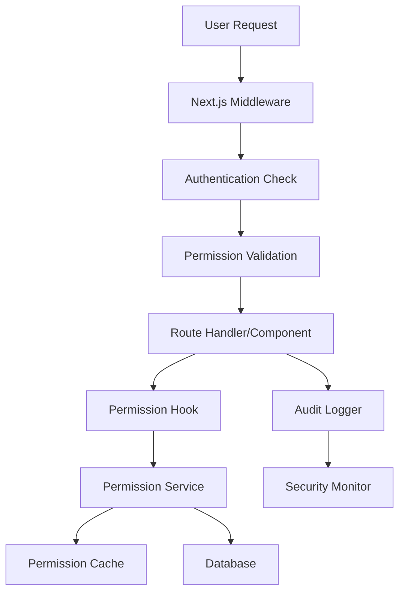

# Production-Ready RBAC System Design

## Overview

This design document outlines the architecture for implementing a comprehensive, production-ready role-based access control (RBAC) system for the Kin Workspace CMS. The design focuses on security, performance, maintainability, and comprehensive testing coverage.

The system will implement a multi-layered security approach with middleware-level route protection, component-level permission checking, and comprehensive audit logging.

## Architecture

### System Architecture Diagram



### Permission Model

The system uses a Resource-Action-Scope (RAS) permission model:

```typescript
interface Permission {
  resource: string    // 'products', 'users', 'analytics', etc.
  action: string     // 'create', 'read', 'update', 'delete', 'manage'
  scope?: string     // 'own', 'all', 'team'
}

interface RolePermission {
  role: UserRole
  permissions: Permission[]
}
```

### Role Hierarchy

```
ADMIN (Full System Access)
├── All resources: manage, all scopes
├── User management: create, update, delete users
├── System settings: configure, monitor
└── Security: audit logs, security settings

EDITOR (Content Management)
├── Products: manage, all scopes
├── Categories: manage, all scopes  
├── Pages: manage, all scopes
├── Media: manage, all scopes
├── Orders: read, all scopes
└── Profile: manage, own scope

VIEWER (Read-Only Access)
├── Products: read, all scopes
├── Categories: read, all scopes
├── Pages: read, all scopes
├── Orders: read, all scopes
└── Profile: manage, own scope
```

## Components and Interfaces

### 1. Permission Service (`app/lib/permissions.ts`)

Central service for all permission operations:

```typescript
export class PermissionService {
  // Core permission checking
  hasPermission(user: User, permission: Permission): boolean
  hasResourceAccess(user: User, resource: string, action: string): boolean
  
  // Role management
  getRolePermissions(role: UserRole): Permission[]
  canUserAccessRoute(user: User, route: string): boolean
  
  // Caching
  getCachedPermission(userId: string, permission: Permission): boolean | null
  setCachedPermission(userId: string, permission: Permission, result: boolean): void
  invalidateUserCache(userId: string): void
}
```

### 2. Route Protection Middleware (`middleware.ts`)

Next.js middleware for route-level protection:

```typescript
export default withAuth(
  function middleware(req) {
    const { pathname } = req.nextUrl
    const token = req.nextauth.token
    
    // Route permission mapping
    const routePermissions = getRoutePermissions(pathname)
    
    if (routePermissions && !hasRouteAccess(token, routePermissions)) {
      return redirectToUnauthorized(req)
    }
    
    // Log access attempt
    logAccessAttempt(token, pathname, 'SUCCESS')
  },
  {
    callbacks: {
      authorized: ({ token }) => !!token
    }
  }
)
```

### 3. Permission Hooks (`app/hooks/usePermissions.ts`)

React hooks for component-level permission checking:

```typescript
export function usePermissions() {
  const { data: session } = useSession()
  const permissionService = usePermissionService()
  
  return {
    // Basic permission checks
    canAccess: (resource: string, action: string) => boolean
    canManage: (resource: string) => boolean
    canCreate: (resource: string) => boolean
    canUpdate: (resource: string, scope?: string) => boolean
    canDelete: (resource: string, scope?: string) => boolean
    
    // Role checks
    isAdmin: () => boolean
    isEditor: () => boolean
    isViewer: () => boolean
    
    // Route checks
    canAccessRoute: (route: string) => boolean
    
    // UI helpers
    filterByPermissions: <T>(items: T[], getResource: (item: T) => string) => T[]
  }
}
```

### 4. Role Guard Components (`app/components/auth/`)

Components for conditional rendering based on permissions:

```typescript
// RoleGuard.tsx
interface RoleGuardProps {
  allowedRoles?: UserRole[]
  requiredPermissions?: Permission[]
  children: React.ReactNode
  fallback?: React.ReactNode
  showError?: boolean
}

// PermissionGate.tsx
interface PermissionGateProps {
  resource: string
  action: string
  scope?: string
  children: React.ReactNode
  fallback?: React.ReactNode
}

// ConditionalRender.tsx
interface ConditionalRenderProps {
  condition: (permissions: PermissionHook) => boolean
  children: React.ReactNode
  fallback?: React.ReactNode
}
```

### 5. Enhanced Navigation Components

Updated navigation components with permission awareness:

```typescript
// Enhanced Sidebar
interface NavigationItem {
  name: string
  href: string
  icon: React.ComponentType
  requiredPermissions: Permission[]
  badge?: string
  children?: NavigationItem[]
}

// Enhanced Header
interface QuickAction {
  id: string
  label: string
  icon: React.ComponentType
  href: string
  requiredPermissions: Permission[]
  shortcut?: string
}
```

## Data Models

### Permission Cache Schema

```typescript
interface PermissionCacheEntry {
  userId: string
  resource: string
  action: string
  scope?: string
  result: boolean
  expiresAt: Date
  createdAt: Date
}
```

### Audit Log Schema

```typescript
interface AuditLog {
  id: string
  userId: string
  action: string
  resource: string
  resourceId?: string
  details: Record<string, any>
  ipAddress: string
  userAgent: string
  timestamp: Date
  success: boolean
  errorMessage?: string
}
```

### Security Event Schema

```typescript
interface SecurityEvent {
  id: string
  type: 'UNAUTHORIZED_ACCESS' | 'PERMISSION_DENIED' | 'SUSPICIOUS_ACTIVITY'
  severity: 'LOW' | 'MEDIUM' | 'HIGH' | 'CRITICAL'
  userId?: string
  ipAddress: string
  details: Record<string, any>
  timestamp: Date
  resolved: boolean
}
```

## Error Handling

### Permission Error Types

```typescript
class PermissionError extends Error {
  code: 'PERMISSION_DENIED' | 'INSUFFICIENT_ROLE' | 'RESOURCE_NOT_FOUND'
  requiredPermission: Permission
  userRole: UserRole
  resource: string
}

class AuthenticationError extends Error {
  code: 'NOT_AUTHENTICATED' | 'SESSION_EXPIRED' | 'INVALID_TOKEN'
  redirectUrl?: string
}
```

### Error Response Format

```typescript
interface ErrorResponse {
  error: {
    code: string
    message: string
    details?: Record<string, any>
    timestamp: string
  }
  success: false
}
```

## Testing Strategy

### 1. Unit Testing

- Permission service logic
- Role hierarchy validation
- Cache functionality
- Error handling

### 2. Component Testing

- Role-based UI rendering
- Permission hook behavior
- Guard component functionality
- Navigation filtering

### 3. Integration Testing

- API endpoint permission validation
- Middleware route protection
- Database permission queries
- Cache invalidation

### 4. End-to-End Testing

- Complete user workflows per role
- Permission boundary testing
- Security scenario testing
- Performance under load

### Test Utilities

```typescript
// Test helpers
export const testUtils = {
  createMockUser: (role: UserRole) => MockUser
  createMockSession: (user: MockUser) => MockSession
  renderWithPermissions: (component: ReactElement, permissions: Permission[]) => RenderResult
  mockPermissionService: (permissions: Record<string, boolean>) => MockPermissionService
}
```

## Security Considerations

### 1. Defense in Depth

- Middleware-level route protection
- Component-level UI filtering
- API-level permission validation
- Database-level access controls

### 2. Input Validation

- All user inputs validated server-side
- SQL injection prevention
- XSS protection
- CSRF token validation

### 3. Audit and Monitoring

- Comprehensive audit logging
- Real-time security monitoring
- Automated threat detection
- Security event alerting

### 4. Performance Security

- Rate limiting on permission checks
- Cache poisoning prevention
- Memory leak protection
- DoS attack mitigation

## Performance Optimization

### 1. Caching Strategy

- In-memory permission cache
- Redis for distributed caching
- Cache invalidation on role changes
- Intelligent cache warming

### 2. Database Optimization

- Indexed permission queries
- Optimized role lookups
- Connection pooling
- Query result caching

### 3. Frontend Optimization

- Lazy loading of permission-gated components
- Memoized permission checks
- Efficient re-rendering strategies
- Bundle splitting by role

This design provides a comprehensive, secure, and performant foundation for the production-ready RBAC system.