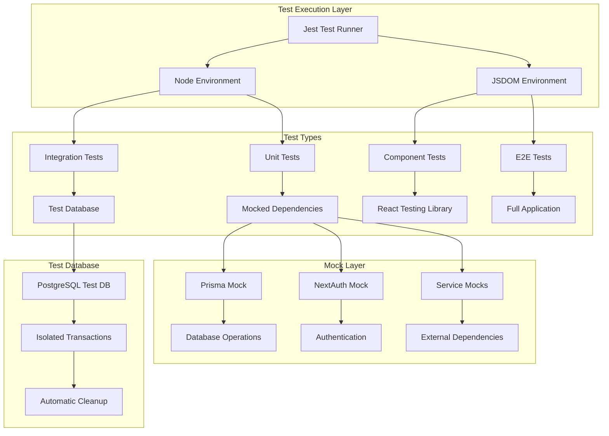

# Testing Infrastructure Fix Design Document

## Overview

This design document outlines the systematic approach to fixing the comprehensive testing infrastructure issues in the Kin Workspace CMS. The solution addresses critical failures in test configuration, missing components, incomplete mocks, and database integration issues through a phased implementation strategy that prioritizes infrastructure fixes before component implementation.

## Architecture

### Testing Architecture Overview



### Test Environment Separation Strategy

**Unit Tests (Mocked)**
- Environment: Node.js
- Database: Fully mocked Prisma client
- Authentication: Mocked NextAuth sessions
- External Services: Mocked implementations
- Execution: Fast, isolated, no external dependencies

**Integration Tests (Real Database)**
- Environment: Node.js
- Database: Real PostgreSQL test database with transactions
- Authentication: Real auth flow with test users
- External Services: Mocked or test implementations
- Execution: Slower, validates complete workflows

**Component Tests (JSDOM)**
- Environment: JSDOM (browser simulation)
- Database: Mocked Prisma client
- Authentication: Mocked sessions
- External Services: Mocked implementations
- Execution: Fast, validates UI interactions

**E2E Tests (Full Application)**
- Environment: JSDOM with full app context
- Database: Real test database
- Authentication: Real auth flow
- External Services: Real or test implementations
- Execution: Slowest, validates complete user journeys

## Components and Interfaces

### 1. Test Configuration Layer

#### Jest Configuration Enhancement
```typescript
interface JestConfig {
  projects: TestProject[]
  globalSetup: string
  globalTeardown: string
  setupFilesAfterEnv: string[]
  moduleNameMapper: Record<string, string>
  transformIgnorePatterns: string[]
  coverageThreshold: CoverageThreshold
}

interface TestProject {
  displayName: string
  testEnvironment: 'node' | 'jsdom'
  testMatch: string[]
  setupFilesAfterEnv: string[]
  moduleNameMapper: Record<string, string>
}
```

#### Module Resolution Strategy
- Fix deprecated `testPathPattern` usage
- Implement proper path mapping for `@/` imports
- Configure ES module transformation for NextAuth dependencies
- Add proper TypeScript compilation for test files

### 2. Database Testing Layer

#### Mock Database Implementation
```typescript
interface MockPrismaClient {
  user: MockUserOperations
  product: MockProductOperations
  category: MockCategoryOperations
  media: MockMediaOperations
  // ... other models
}

interface MockUserOperations {
  create: jest.MockedFunction<any>
  findUnique: jest.MockedFunction<any>
  findMany: jest.MockedFunction<any>
  update: jest.MockedFunction<any>
  delete: jest.MockedFunction<any>
}
```

#### Test Database Management
```typescript
interface TestDatabaseManager {
  setup(): Promise<void>
  cleanup(): Promise<void>
  createTransaction(): Promise<PrismaTransaction>
  rollbackTransaction(tx: PrismaTransaction): Promise<void>
  seedTestData(): Promise<TestDataSet>
}

interface TestDataSet {
  users: TestUser[]
  products: TestProduct[]
  categories: TestCategory[]
  media: TestMedia[]
}
```

### 3. Authentication Mock Layer

#### NextAuth Mock Implementation
```typescript
interface MockNextAuth {
  getServerSession: jest.MockedFunction<any>
  getSession: jest.MockedFunction<any>
  signIn: jest.MockedFunction<any>
  signOut: jest.MockedFunction<any>
}

interface MockSession {
  user: {
    id: string
    email: string
    name: string
    role: UserRole
  }
  expires: string
}

interface AuthTestHelpers {
  createMockSession(role: UserRole): MockSession
  mockAuthenticatedRequest(session: MockSession): NextRequest
  mockUnauthenticatedRequest(): NextRequest
}
```

### 4. Missing API Routes Implementation

#### Authentication Routes
```typescript
// /api/auth/login/route.ts
interface LoginRequest {
  email: string
  password: string
}

interface LoginResponse {
  success: boolean
  user?: UserProfile
  token?: string
  error?: string
}

// /api/auth/me/route.ts
interface ProfileResponse {
  user: UserProfile
  permissions: string[]
}
```

#### Public API Routes
```typescript
// /api/public/products/route.ts
interface PublicProductsResponse {
  products: PublicProduct[]
  pagination: PaginationInfo
  filters: FilterOptions
}

// /api/public/categories/route.ts
interface PublicCategoriesResponse {
  categories: PublicCategory[]
  hierarchy: CategoryTree
}
```

#### Workflow and Analytics Routes
```typescript
// /api/workflow/route.ts
interface WorkflowRequest {
  contentId: string
  action: 'submit' | 'approve' | 'reject' | 'publish'
  comment?: string
}

// /api/analytics/route.ts
interface AnalyticsResponse {
  overview: AnalyticsOverview
  metrics: AnalyticsMetrics
  trends: AnalyticsTrends
}
```

### 5. Missing Components Implementation

#### Product Components
```typescript
// ProductImageGallery Component
interface ProductImageGalleryProps {
  images: MediaFile[]
  onImageSelect: (image: MediaFile) => void
  onImageReorder: (images: MediaFile[]) => void
  onImageRemove: (imageId: string) => void
}

// MediaPicker Component
interface MediaPickerProps {
  onSelect: (media: MediaFile[]) => void
  multiple?: boolean
  accept?: string[]
  folder?: string
}
```

#### Page Management Components
```typescript
// PageList Component
interface PageListProps {
  pages: Page[]
  onEdit: (page: Page) => void
  onDelete: (pageId: string) => void
  onStatusChange: (pageId: string, status: PageStatus) => void
}

// PageForm Component
interface PageFormProps {
  page?: Page
  onSave: (pageData: PageFormData) => void
  onCancel: () => void
}

// TemplateSelector Component
interface TemplateSelectorProps {
  templates: PageTemplate[]
  selected?: string
  onSelect: (templateId: string) => void
}
```

#### Media Management Components
```typescript
// MediaFolderTree Component
interface MediaFolderTreeProps {
  folders: MediaFolder[]
  selectedFolder?: string
  onFolderSelect: (folderId: string) => void
  onFolderCreate: (parentId: string, name: string) => void
}

// MediaBulkActions Component
interface MediaBulkActionsProps {
  selectedMedia: string[]
  onMove: (folderId: string) => void
  onDelete: () => void
  onTag: (tags: string[]) => void
}

// MediaMetadataEditor Component
interface MediaMetadataEditorProps {
  media: MediaFile
  onSave: (metadata: MediaMetadata) => void
  onCancel: () => void
}
```

### 6. Service Layer Implementation

#### Cache Service Implementation
```typescript
interface CacheService {
  getInstance(config: CacheConfig): CacheService
  get<T>(key: string): Promise<T | null>
  set<T>(key: string, value: T, ttl?: number): Promise<void>
  delete(key: string): Promise<void>
  clear(): Promise<void>
  getStats(): CacheStats
}

interface DatabaseCache {
  getProducts(params: ProductQueryParams): Promise<ProductsResult>
  getProduct(id: string): Promise<Product | null>
  getCategories(params: CategoryQueryParams): Promise<Category[]>
  invalidateProduct(id: string): Promise<void>
  invalidateProducts(): Promise<void>
}

interface ImageCache {
  cacheImageMetadata(originalPath: string, processedPath: string, metadata: ImageMetadata): Promise<void>
  getCachedImageMetadata(originalPath: string, options: ImageOptions): Promise<CachedImage | null>
  invalidateImageCache(path: string): Promise<void>
}
```

## Data Models

### Test Data Models

#### Test User Model
```typescript
interface TestUser {
  id: string
  email: string
  name: string
  role: UserRole
  passwordHash: string
  isActive: boolean
  createdAt: Date
  updatedAt: Date
}
```

#### Test Product Model
```typescript
interface TestProduct {
  id: string
  name: string
  slug: string
  description: string
  price: number
  status: ProductStatus
  categoryIds: string[]
  mediaIds: string[]
  createdBy: string
}
```

#### Test Session Model
```typescript
interface TestSession {
  user: {
    id: string
    email: string
    name: string
    role: UserRole
  }
  expires: string
  accessToken?: string
}
```

## Error Handling

### Test Error Categories

#### Configuration Errors
- Jest configuration validation
- Module resolution failures
- Environment setup issues
- Dependency compatibility problems

#### Database Errors
- Connection failures
- Transaction rollback issues
- Data cleanup failures
- Unique constraint violations

#### Mock Errors
- Mock setup failures
- Mock expectation mismatches
- Mock reset issues
- Mock data inconsistencies

#### Component Errors
- Rendering failures
- Event handling issues
- Props validation errors
- State management problems

### Error Recovery Strategies

#### Automatic Recovery
- Database transaction rollback on test failure
- Mock state reset between tests
- Temporary file cleanup
- Connection pool management

#### Manual Recovery
- Test database recreation
- Cache invalidation
- Mock factory reset
- Component unmounting

## Testing Strategy

### Test Organization Structure

```
tests/
├── unit/                    # Unit tests with mocks
│   ├── lib/                # Library function tests
│   ├── utils/              # Utility function tests
│   └── services/           # Service layer tests
├── integration/            # Integration tests with real DB
│   ├── api/               # API endpoint tests
│   ├── auth/              # Authentication flow tests
│   └── workflows/         # Complete workflow tests
├── components/            # Component tests with JSDOM
│   ├── forms/             # Form component tests
│   ├── tables/            # Table component tests
│   └── ui/                # UI component tests
├── e2e/                   # End-to-end tests
│   ├── admin/             # Admin workflow tests
│   └── public/            # Public API tests
├── fixtures/              # Test data fixtures
├── helpers/               # Test helper functions
└── setup/                 # Test setup and configuration
```

### Test Execution Strategy

#### Phase 1: Unit Tests
- Execute fastest tests first
- Use mocked dependencies
- Validate individual function behavior
- Target: <30 seconds execution time

#### Phase 2: Component Tests
- Test UI component behavior
- Validate user interactions
- Test component integration
- Target: <60 seconds execution time

#### Phase 3: Integration Tests
- Test API endpoints with real database
- Validate complete workflows
- Test data persistence
- Target: <120 seconds execution time

#### Phase 4: E2E Tests
- Test complete user journeys
- Validate cross-component interactions
- Test authentication flows
- Target: <180 seconds execution time

### Coverage Strategy

#### Coverage Targets
- **Branches**: 80% minimum
- **Functions**: 80% minimum
- **Lines**: 80% minimum
- **Statements**: 80% minimum

#### Coverage Exclusions
- Layout components (`layout.tsx`)
- Page components (`page.tsx`)
- Type definition files (`*.d.ts`)
- Configuration files
- Test files themselves

#### Coverage Reporting
- Generate HTML coverage reports
- Export LCOV format for CI integration
- Track coverage trends over time
- Fail builds on coverage regression

## Implementation Phases

### Phase 1: Infrastructure Foundation (Priority 1)
1. **Jest Configuration Fix**
   - Update deprecated options
   - Fix module resolution
   - Configure test environments
   - Add missing dependencies

2. **Database Mock Implementation**
   - Create comprehensive Prisma mocks
   - Implement mock reset functionality
   - Add mock data factories
   - Configure test database isolation

3. **Authentication Mock Setup**
   - Mock NextAuth functionality
   - Create session test helpers
   - Fix ES module compatibility
   - Implement role-based testing

### Phase 2: Missing Implementation (Priority 2)
1. **API Routes Creation**
   - Implement authentication routes
   - Create public API endpoints
   - Add workflow management routes
   - Build analytics endpoints

2. **Component Implementation**
   - Create product management components
   - Build page management components
   - Implement media management components
   - Add shared utility components

3. **Service Layer Completion**
   - Implement cache services
   - Complete search service
   - Add image processing services
   - Create database utilities

### Phase 3: Test Enhancement (Priority 3)
1. **Test Quality Improvement**
   - Fix failing assertions
   - Improve test descriptions
   - Add edge case coverage
   - Enhance error testing

2. **Integration Test Fixes**
   - Fix database cleanup issues
   - Improve test isolation
   - Add transaction management
   - Enhance data seeding

3. **Performance Optimization**
   - Optimize test execution speed
   - Improve parallel test execution
   - Reduce test dependencies
   - Enhance mock performance

### Phase 4: CI/CD Integration (Priority 4)
1. **Continuous Integration Setup**
   - Configure GitHub Actions
   - Add automated test execution
   - Implement coverage reporting
   - Set up failure notifications

2. **Quality Gates**
   - Require tests to pass for deployment
   - Enforce coverage thresholds
   - Add performance benchmarks
   - Implement security scanning

## Success Metrics

### Immediate Success Criteria
- ✅ All 427+ tests execute without configuration errors
- ✅ Zero test failures due to missing dependencies
- ✅ Proper separation of unit vs integration tests
- ✅ All mocks function correctly without real dependencies

### Quality Success Criteria
- ✅ 80%+ test coverage across all metrics
- ✅ Tests execute in under 5 minutes total
- ✅ Zero flaky or inconsistent test results
- ✅ Comprehensive error handling and edge case coverage

### Long-term Success Criteria
- ✅ CI/CD pipeline integration with automated testing
- ✅ Developer productivity improvement through reliable tests
- ✅ Regression prevention through comprehensive coverage
- ✅ Maintainable test suite with clear documentation