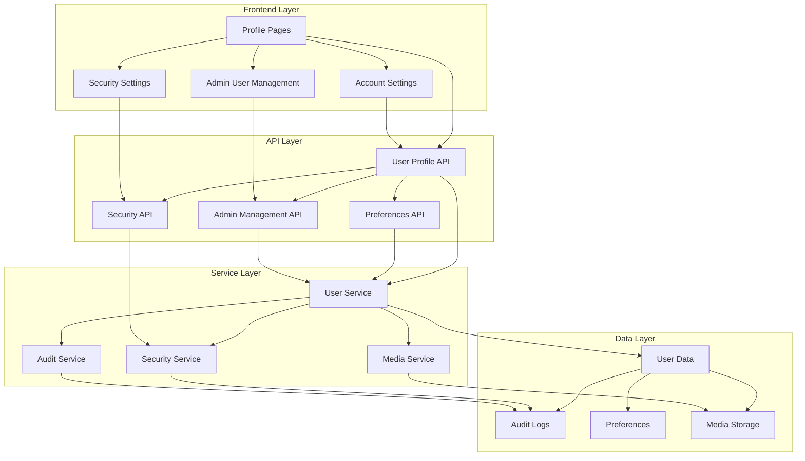
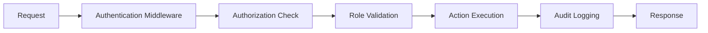

# Design Document

## Overview

This design document outlines the architecture and implementation approach for the enhanced user profile and account management system. The design builds upon the existing Next.js application structure and extends it with comprehensive user management capabilities, security features, and administrative tools.

The system will provide a multi-layered approach to user management, with different interfaces and capabilities based on user roles, while maintaining security and usability as primary concerns.

## Architecture

### High-Level Architecture



### Component Architecture

The system follows a modular component architecture with clear separation of concerns:

1. **Page Components** - Route-level components that orchestrate the user experience
2. **Feature Components** - Reusable components for specific functionality
3. **UI Components** - Basic building blocks for consistent interface
4. **Service Layer** - Business logic and data processing
5. **API Layer** - RESTful endpoints for data operations

### Security Architecture



## Components and Interfaces

### Core Components

#### 1. Enhanced Profile Page (`app/profile/page.tsx`)
- **Purpose**: Main profile management interface
- **Features**: Basic info editing, password change, profile picture upload
- **Props**: None (uses session data)
- **State Management**: Local state with form validation

#### 2. Account Settings Component (`app/components/profile/AccountSettings.tsx`)
- **Purpose**: Comprehensive account configuration
- **Features**: Email management, notification preferences, theme settings
- **Props**: `{ user: User, onUpdate: (data: UserUpdate) => void }`
- **State Management**: Form state with optimistic updates

#### 3. Security Settings Component (`app/components/profile/SecuritySettings.tsx`)
- **Purpose**: Security and privacy management
- **Features**: Password policies, 2FA setup, session management, audit logs
- **Props**: `{ user: User, securityData: SecurityInfo }`
- **State Management**: Security state with validation

#### 4. Profile Picture Manager (`app/components/profile/ProfilePictureManager.tsx`)
- **Purpose**: Image upload and management
- **Features**: Drag-and-drop upload, cropping, optimization
- **Props**: `{ currentImage?: string, onUpload: (file: File) => void }`
- **State Management**: Upload state with progress tracking

#### 5. Admin User Management (`app/components/admin/UserManagement.tsx`)
- **Purpose**: Administrative user operations
- **Features**: User list, bulk operations, role management
- **Props**: `{ users: User[], permissions: AdminPermissions }`
- **State Management**: Table state with filtering and pagination

#### 6. User Activity Monitor (`app/components/admin/UserActivityMonitor.tsx`)
- **Purpose**: User activity tracking and audit
- **Features**: Login history, action logs, security alerts
- **Props**: `{ userId?: string, timeRange: DateRange }`
- **State Management**: Activity data with real-time updates

### API Interfaces

#### User Profile API (`/api/users/[id]`)
```typescript
interface UserProfileAPI {
  GET: () => Promise<{ user: UserProfile }>
  PUT: (data: UserUpdateData) => Promise<{ user: UserProfile }>
  DELETE: () => Promise<{ success: boolean }>
}

interface UserProfile {
  id: string
  name: string
  email: string
  role: UserRole
  isActive: boolean
  profilePicture?: string
  preferences: UserPreferences
  createdAt: Date
  updatedAt: Date
}
```

#### Security API (`/api/users/[id]/security`)
```typescript
interface SecurityAPI {
  GET: () => Promise<{ security: SecurityInfo }>
  PUT: (data: SecurityUpdate) => Promise<{ success: boolean }>
}

interface SecurityInfo {
  twoFactorEnabled: boolean
  lastPasswordChange: Date
  activeSessions: Session[]
  recentActivity: ActivityLog[]
}
```

#### Preferences API (`/api/users/[id]/preferences`)
```typescript
interface PreferencesAPI {
  GET: () => Promise<{ preferences: UserPreferences }>
  PUT: (data: PreferencesUpdate) => Promise<{ preferences: UserPreferences }>
}

interface UserPreferences {
  theme: 'light' | 'dark' | 'system'
  timezone: string
  language: string
  notifications: NotificationSettings
  dashboard: DashboardSettings
}
```

## Data Models

### Enhanced User Model
```typescript
interface User {
  id: string
  name: string
  email: string
  passwordHash: string
  role: UserRole
  isActive: boolean
  profilePicture?: string
  emailVerified?: Date
  twoFactorSecret?: string
  twoFactorEnabled: boolean
  lastLoginAt?: Date
  createdAt: Date
  updatedAt: Date
  
  // Relations
  preferences?: UserPreferences
  sessions: Session[]
  auditLogs: AuditLog[]
}
```

### User Preferences Model
```typescript
interface UserPreferences {
  id: string
  userId: string
  theme: Theme
  timezone: string
  language: string
  notifications: NotificationSettings
  dashboard: DashboardSettings
  createdAt: Date
  updatedAt: Date
}
```

### Audit Log Model
```typescript
interface AuditLog {
  id: string
  userId: string
  action: string
  resource: string
  details: Record<string, any>
  ipAddress: string
  userAgent: string
  createdAt: Date
}
```

### Session Model
```typescript
interface Session {
  id: string
  userId: string
  token: string
  expiresAt: Date
  ipAddress: string
  userAgent: string
  isActive: boolean
  createdAt: Date
}
```

## Error Handling

### Error Types and Responses

#### Validation Errors
```typescript
interface ValidationError {
  code: 'VALIDATION_ERROR'
  message: string
  details: Array<{
    field: string
    message: string
  }>
}
```

#### Security Errors
```typescript
interface SecurityError {
  code: 'SECURITY_ERROR'
  message: string
  action: 'LOCK_ACCOUNT' | 'REQUIRE_2FA' | 'LOG_SECURITY_EVENT'
}
```

#### Permission Errors
```typescript
interface PermissionError {
  code: 'PERMISSION_DENIED'
  message: string
  requiredRole: UserRole
  currentRole: UserRole
}
```

### Error Handling Strategy

1. **Client-Side Validation**: Immediate feedback using Zod schemas
2. **Server-Side Validation**: Comprehensive validation with detailed error messages
3. **Security Error Handling**: Automatic security measures for suspicious activity
4. **User-Friendly Messages**: Clear, actionable error messages for users
5. **Audit Trail**: All errors logged for security and debugging purposes

## Testing Strategy

### Unit Testing
- **Component Testing**: React Testing Library for all UI components
- **API Testing**: Jest for all API endpoints with mocked dependencies
- **Service Testing**: Unit tests for business logic and utilities
- **Validation Testing**: Comprehensive tests for all Zod schemas

### Integration Testing
- **API Integration**: End-to-end API testing with real database
- **Authentication Flow**: Complete authentication and authorization testing
- **File Upload**: Image processing and storage integration tests
- **Security Features**: 2FA, session management, and audit logging tests

### Security Testing
- **Input Validation**: SQL injection and XSS prevention tests
- **Authentication**: Session security and token validation tests
- **Authorization**: Role-based access control tests
- **Audit Trail**: Comprehensive logging verification tests

### Performance Testing
- **Image Processing**: Upload and optimization performance tests
- **Database Queries**: Query optimization and performance monitoring
- **API Response Times**: Endpoint performance benchmarking
- **Frontend Performance**: Component rendering and interaction tests

### Test Data Management
- **Test Fixtures**: Standardized test data for consistent testing
- **Database Seeding**: Automated test data setup and teardown
- **Mock Services**: Comprehensive mocking for external dependencies
- **Test Isolation**: Proper cleanup between tests to prevent interference

## Implementation Considerations

### Security Considerations
1. **Password Security**: Bcrypt hashing with proper salt rounds
2. **Session Management**: Secure session tokens with proper expiration
3. **Input Validation**: Server-side validation for all user inputs
4. **File Upload Security**: Image validation, size limits, and secure storage
5. **Audit Logging**: Comprehensive logging of all security-relevant actions

### Performance Considerations
1. **Image Optimization**: Automatic resizing and format optimization
2. **Database Indexing**: Proper indexes for user queries and audit logs
3. **Caching Strategy**: Redis caching for frequently accessed data
4. **Lazy Loading**: Component and data lazy loading for better performance
5. **Pagination**: Efficient pagination for large datasets

### Scalability Considerations
1. **Database Design**: Normalized schema with proper relationships
2. **API Design**: RESTful APIs with consistent patterns
3. **Component Architecture**: Reusable, modular components
4. **State Management**: Efficient state management with minimal re-renders
5. **Error Boundaries**: Proper error isolation and recovery

### Accessibility Considerations
1. **ARIA Labels**: Proper accessibility labels for all interactive elements
2. **Keyboard Navigation**: Full keyboard accessibility for all features
3. **Screen Reader Support**: Semantic HTML and proper heading structure
4. **Color Contrast**: WCAG compliant color schemes and contrast ratios
5. **Focus Management**: Proper focus management for modal dialogs and forms