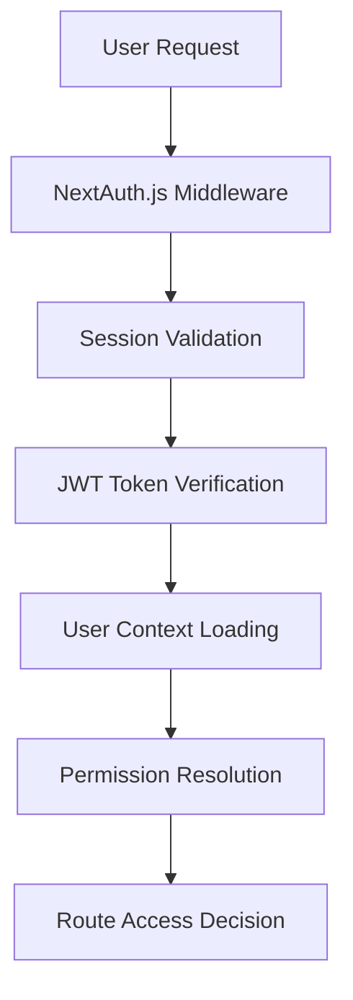
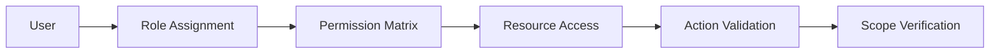
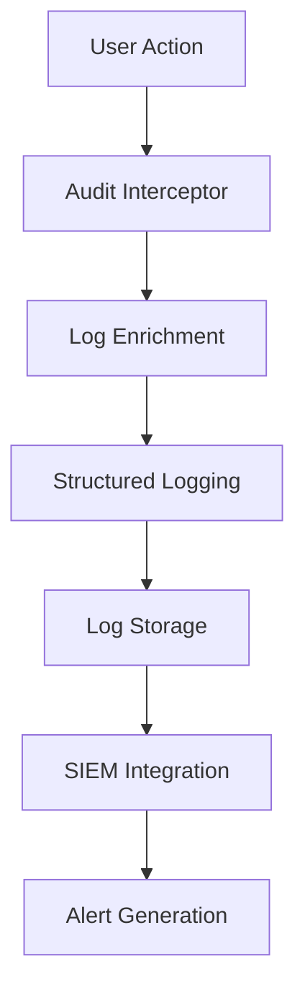
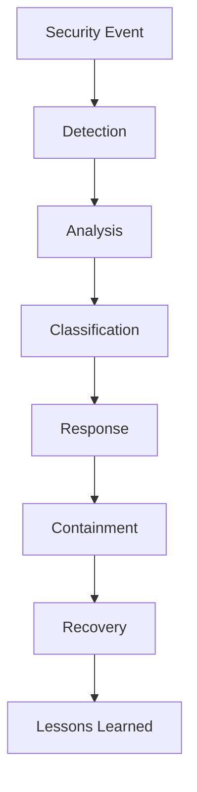

# Security Architecture Documentation

## Overview

This document outlines the comprehensive security architecture implemented in the Kin Workspace CMS production-ready RBAC system. The architecture follows defense-in-depth principles with multiple layers of security controls.

## Security Architecture Layers

### 1. Network Security Layer

#### Transport Security
- **HTTPS Enforcement**: All communications encrypted using TLS 1.2+
- **HSTS Headers**: HTTP Strict Transport Security prevents protocol downgrade attacks
- **Certificate Management**: Automated certificate renewal and validation

#### Network Controls
- **Rate Limiting**: API endpoints protected against abuse and DoS attacks
- **IP Allowlisting**: Administrative functions restricted to approved IP ranges
- **Firewall Rules**: Database and internal services protected by network firewalls

### 2. Application Security Layer

#### Authentication Architecture


#### Authentication Components
- **NextAuth.js Integration**: Secure session management with JWT tokens
- **Multi-Factor Authentication**: TOTP-based 2FA for administrative accounts
- **Session Management**: Secure session storage with automatic expiration
- **Password Security**: Bcrypt hashing with salt rounds configuration

#### Authorization Architecture


#### Permission Model
- **Resource-Action-Scope (RAS)**: Granular permission control
- **Role Hierarchy**: Structured role inheritance system
- **Dynamic Permissions**: Runtime permission evaluation
- **Permission Caching**: Performance-optimized permission storage

### 3. Data Security Layer

#### Database Security
- **Connection Encryption**: All database connections use SSL/TLS
- **Access Controls**: Database-level user permissions and role separation
- **Query Protection**: Parameterized queries prevent SQL injection
- **Data Encryption**: Sensitive data encrypted at rest using AES-256

#### Data Classification
```
CRITICAL: User credentials, payment information, personal data
SENSITIVE: User profiles, order details, business analytics
INTERNAL: Product catalogs, system configurations
PUBLIC: Marketing content, public product information
```

#### Data Protection Measures
- **Field-Level Encryption**: PII and sensitive data encrypted in database
- **Data Masking**: Sensitive data masked in logs and non-production environments
- **Backup Encryption**: All backups encrypted with separate key management
- **Data Retention**: Automated data lifecycle management and purging

### 4. Infrastructure Security Layer

#### Container Security
- **Base Image Scanning**: Vulnerability scanning of Docker base images
- **Runtime Security**: Container runtime monitoring and protection
- **Resource Limits**: CPU and memory limits prevent resource exhaustion
- **Network Isolation**: Container network segmentation

#### Deployment Security
- **Secrets Management**: Environment variables and secrets stored securely
- **Configuration Security**: Security configurations version controlled
- **Update Management**: Automated security patch deployment
- **Monitoring Integration**: Security events integrated with monitoring systems

## Security Controls Implementation

### Input Validation and Sanitization

#### Server-Side Validation
```typescript
// Example validation schema
const userInputSchema = z.object({
  email: z.string().email().max(255),
  name: z.string().min(1).max(100).regex(/^[a-zA-Z\s]+$/),
  role: z.enum(['ADMIN', 'EDITOR', 'VIEWER'])
});

// Sanitization middleware
export function sanitizeInput(input: unknown): unknown {
  if (typeof input === 'string') {
    return DOMPurify.sanitize(input);
  }
  return input;
}
```

#### Client-Side Protection
- **CSP Headers**: Content Security Policy prevents XSS attacks
- **Input Sanitization**: Client-side input cleaning and validation
- **Form Protection**: CSRF tokens on all state-changing operations
- **Output Encoding**: Proper encoding of user-generated content

### API Security Controls

#### Authentication Middleware
```typescript
export async function apiAuthMiddleware(req: NextRequest) {
  const token = await getToken({ req });
  
  if (!token) {
    return new Response('Unauthorized', { status: 401 });
  }
  
  // Validate token freshness
  if (Date.now() - token.iat > SESSION_TIMEOUT) {
    return new Response('Session Expired', { status: 401 });
  }
  
  return null; // Continue to next middleware
}
```

#### Permission Validation
```typescript
export async function validateApiPermission(
  req: NextRequest,
  resource: string,
  action: string
) {
  const user = await getCurrentUser(req);
  const hasPermission = await permissionService.hasPermission(
    user,
    { resource, action }
  );
  
  if (!hasPermission) {
    await auditLogger.logUnauthorizedAccess(user, resource, action);
    return new Response('Forbidden', { status: 403 });
  }
  
  return null;
}
```

### Audit and Monitoring Architecture

#### Audit Logging System


#### Security Event Detection
- **Anomaly Detection**: Machine learning-based unusual activity detection
- **Threat Intelligence**: Integration with threat intelligence feeds
- **Behavioral Analysis**: User behavior pattern analysis
- **Real-time Alerting**: Immediate notification of security events

#### Monitoring Metrics
```typescript
interface SecurityMetrics {
  authenticationFailures: number;
  permissionDenials: number;
  suspiciousActivities: number;
  dataAccessPatterns: AccessPattern[];
  systemVulnerabilities: Vulnerability[];
}
```

## Security Architecture Patterns

### Defense in Depth Implementation

#### Layer 1: Perimeter Security
- Web Application Firewall (WAF)
- DDoS protection
- Geographic access controls
- Bot detection and mitigation

#### Layer 2: Application Security
- Authentication and authorization
- Input validation and sanitization
- Session management
- API security controls

#### Layer 3: Data Security
- Encryption at rest and in transit
- Database access controls
- Data classification and handling
- Backup security

#### Layer 4: Infrastructure Security
- Network segmentation
- Container security
- Secrets management
- Monitoring and logging

### Zero Trust Architecture Principles

#### Never Trust, Always Verify
- Every request authenticated and authorized
- Continuous security posture assessment
- Least privilege access enforcement
- Micro-segmentation implementation

#### Assume Breach Mentality
- Comprehensive audit logging
- Behavioral monitoring
- Incident response automation
- Recovery and resilience planning

## Security Testing Architecture

### Automated Security Testing
```typescript
// Security test automation
export class SecurityTestSuite {
  async runVulnerabilityScans(): Promise<ScanResult[]> {
    return await Promise.all([
      this.sqlInjectionTests(),
      this.xssTests(),
      this.authenticationBypassTests(),
      this.permissionEscalationTests()
    ]);
  }
  
  async validateSecurityHeaders(): Promise<HeaderValidation> {
    // Validate CSP, HSTS, X-Frame-Options, etc.
  }
}
```

### Penetration Testing Framework
- **Automated Scanning**: Regular vulnerability assessments
- **Manual Testing**: Expert security review and testing
- **Red Team Exercises**: Simulated attack scenarios
- **Bug Bounty Program**: Community-driven security testing

## Incident Response Architecture

### Security Incident Workflow


### Automated Response Capabilities
- **Account Lockout**: Automatic suspicious account disabling
- **IP Blocking**: Dynamic IP blacklisting for threats
- **Session Termination**: Force logout for compromised sessions
- **Alert Escalation**: Automated notification of security teams

## Compliance Architecture

### Regulatory Compliance Framework
- **GDPR Compliance**: Data protection and privacy controls
- **SOC 2 Type II**: Security, availability, and confidentiality controls
- **ISO 27001**: Information security management system
- **PCI DSS**: Payment card industry security standards

### Compliance Monitoring
```typescript
interface ComplianceCheck {
  standard: string;
  requirement: string;
  status: 'COMPLIANT' | 'NON_COMPLIANT' | 'PARTIAL';
  evidence: string[];
  lastChecked: Date;
  nextReview: Date;
}
```

This security architecture provides comprehensive protection across all layers of the application stack while maintaining performance and usability requirements.