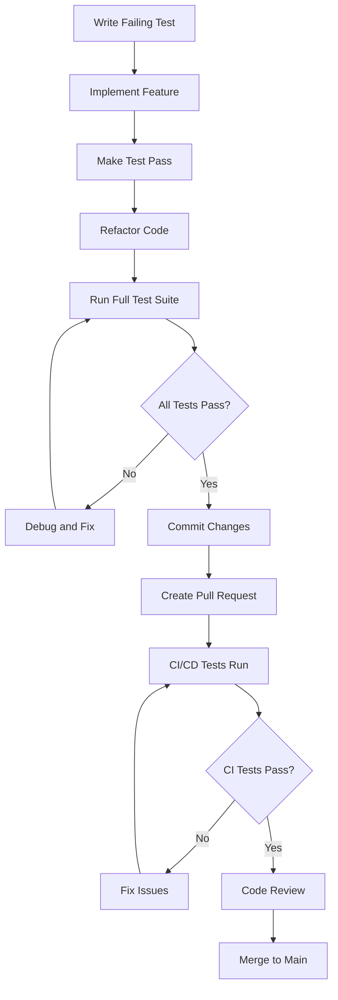
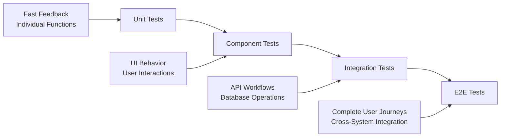

# CMS Testing Documentation Index

## Overview

This is the comprehensive testing documentation for the Kin Workspace CMS. This documentation covers all aspects of testing from initial setup to advanced debugging techniques, providing developers with the knowledge and tools needed to maintain a robust test suite.

## Documentation Structure

### 📋 [Testing Guidelines and Best Practices](./TESTING_GUIDELINES.md)
**Purpose**: Core testing principles, standards, and patterns
**Audience**: All developers
**Key Topics**:
- Test-first development approach
- Testing standards and coverage requirements
- CMS-specific testing patterns (CRUD, auth, API)
- Mock implementation guidelines
- Performance and CI/CD integration
- Comprehensive do's and don'ts

### 🔧 [Test Setup and Configuration Guide](./TEST_SETUP_GUIDE.md)
**Purpose**: Step-by-step setup instructions and configuration
**Audience**: New team members, DevOps, developers setting up environments
**Key Topics**:
- Prerequisites and system requirements
- Database setup and configuration
- Jest configuration and module mapping
- Mock implementations (Prisma, NextAuth)
- CI/CD pipeline configuration
- Troubleshooting common setup issues

### 🏗️ [Test Structure and Organization Guide](./TEST_STRUCTURE_GUIDE.md)
**Purpose**: Organizational patterns and structural standards
**Audience**: All developers, team leads
**Key Topics**:
- Directory structure and file organization
- Naming conventions for tests and suites
- Test organization patterns (feature-based vs implementation-based)
- Test data management and factories
- Mock organization strategies
- Performance testing patterns

### 🐛 [Test Debugging Guide](./TEST_DEBUGGING_GUIDE.md)
**Purpose**: Troubleshooting and debugging techniques
**Audience**: All developers, especially when encountering test failures
**Key Topics**:
- Systematic debugging approaches
- Common error categories and solutions
- Database and Prisma debugging
- Authentication and session issues
- Component testing problems
- Performance debugging techniques

### 🎓 [Testing Onboarding Guide for New Developers](./TESTING_ONBOARDING_GUIDE.md)
**Purpose**: Learning path and practical examples for new team members
**Audience**: New developers, interns, junior developers
**Key Topics**:
- Quick start checklist and learning path
- Hands-on examples and tutorials
- Common testing scenarios with code examples
- Best practices and common mistakes
- Team resources and getting help

## Quick Reference

### Essential Commands
```bash
# Run all tests
npm test

# Run specific test types
npm run test:unit          # Unit tests only
npm run test:integration   # Integration tests only
npm run test:components    # Component tests only
npm run test:e2e          # End-to-end tests only

# Development and debugging
npm run test:watch        # Watch mode for development
npm run test:coverage     # Generate coverage reports
npm run test:debug        # Debug mode with breakpoints

# CI/CD
npm run test:ci           # CI-optimized test run
```

### Test File Locations
```
__tests__/               # Unit and component tests
├── api/                # API route unit tests
├── components/         # Component unit tests
├── lib/               # Library function tests
├── helpers/           # Test utilities
└── e2e/              # End-to-end tests

tests/                  # Integration and specialized tests
├── integration/       # Integration tests
├── api/              # API integration tests
├── components/       # Component integration tests
├── database/         # Database-specific tests
└── performance/      # Performance tests

__mocks__/             # Mock implementations
├── @/                # Application mocks
├── next-auth/        # NextAuth mocks
└── external-services/ # External service mocks
```

### Coverage Requirements
- **Minimum Coverage**: 80% for branches, functions, lines, statements
- **Critical Paths**: 100% coverage for authentication, payment, data validation
- **New Code**: All new features must include comprehensive tests
- **Bug Fixes**: Must include regression tests

## Getting Started Paths

### For New Developers
1. Start with [Testing Onboarding Guide](./TESTING_ONBOARDING_GUIDE.md)
2. Follow the Day 1 checklist for environment setup
3. Complete your first test following the guided examples
4. Reference other guides as needed for specific topics

### For Experienced Developers New to the Project
1. Review [Test Setup Guide](./TEST_SETUP_GUIDE.md) for environment configuration
2. Study [Test Structure Guide](./TEST_STRUCTURE_GUIDE.md) for organizational patterns
3. Reference [Testing Guidelines](./TESTING_GUIDELINES.md) for standards and best practices
4. Use [Debugging Guide](./TEST_DEBUGGING_GUIDE.md) when encountering issues

### For Team Leads and Architects
1. Review [Testing Guidelines](./TESTING_GUIDELINES.md) for standards enforcement
2. Study [Test Structure Guide](./TEST_STRUCTURE_GUIDE.md) for organizational decisions
3. Reference [Setup Guide](./TEST_SETUP_GUIDE.md) for CI/CD and infrastructure
4. Use all guides for team training and onboarding planning

## Testing Workflow

### Development Workflow


### Test Types by Development Phase


## Maintenance and Updates

### Regular Maintenance Tasks

#### Weekly
- [ ] Review test coverage reports
- [ ] Check for flaky tests
- [ ] Update test documentation if needed
- [ ] Review and merge test infrastructure improvements

#### Monthly
- [ ] Update testing dependencies
- [ ] Review and optimize test performance
- [ ] Audit test quality and coverage
- [ ] Update testing guidelines based on learnings

#### Quarterly
- [ ] Comprehensive test infrastructure review
- [ ] Update onboarding materials
- [ ] Review and update CI/CD pipeline
- [ ] Team training on new testing practices

### Documentation Updates

When updating this documentation:

1. **Keep it current**: Update examples and commands as the codebase evolves
2. **Maintain consistency**: Ensure all guides use consistent terminology and patterns
3. **Add real examples**: Include actual code examples from the project
4. **Get feedback**: Have team members review updates for clarity and accuracy
5. **Version control**: Track changes and maintain backward compatibility notes

## Support and Resources

### Internal Resources
- **Team Chat**: #testing-help channel for quick questions
- **Code Reviews**: Include test quality in all code reviews
- **Pair Programming**: Schedule sessions for complex testing scenarios
- **Knowledge Sharing**: Weekly testing tips and best practices sharing

### External Resources
- [Jest Documentation](https://jestjs.io/docs/getting-started)
- [React Testing Library](https://testing-library.com/docs/react-testing-library/intro/)
- [Next.js Testing Guide](https://nextjs.org/docs/testing)
- [Prisma Testing Guide](https://www.prisma.io/docs/guides/testing)
- [Testing Best Practices](https://kentcdodds.com/blog/common-mistakes-with-react-testing-library)

### Community Resources
- [Testing JavaScript](https://testingjavascript.com/) - Comprehensive testing course
- [Test Driven Development](https://www.amazon.com/Test-Driven-Development-Kent-Beck/dp/0321146530) - Classic TDD book
- [Clean Code](https://www.amazon.com/Clean-Code-Handbook-Software-Craftsmanship/dp/0132350882) - Code quality principles

## Contributing to Testing Documentation

### How to Contribute
1. **Identify gaps**: Notice missing information or outdated examples
2. **Create issues**: Document what needs to be updated or added
3. **Submit PRs**: Include documentation updates with code changes
4. **Review others**: Help review documentation changes from team members

### Documentation Standards
- **Clear examples**: Always include working code examples
- **Step-by-step instructions**: Break down complex procedures
- **Cross-references**: Link related sections and external resources
- **Regular updates**: Keep examples current with the latest codebase
- **Accessibility**: Ensure documentation is accessible to developers of all skill levels

## Conclusion

This testing documentation provides a comprehensive foundation for maintaining high-quality tests in the CMS application. By following these guidelines and utilizing these resources, developers can:

- Write effective, maintainable tests
- Debug issues quickly and efficiently
- Maintain high code coverage and quality
- Onboard new team members effectively
- Contribute to a robust testing culture

Remember: **Good tests are an investment in code quality, developer productivity, and system reliability.**

---

*Last updated: [Current Date]*
*Next review: [Next Quarter]*
*Maintained by: Development Team*